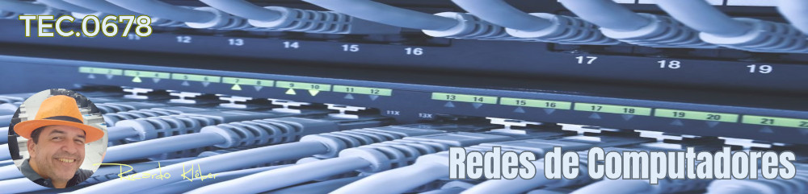
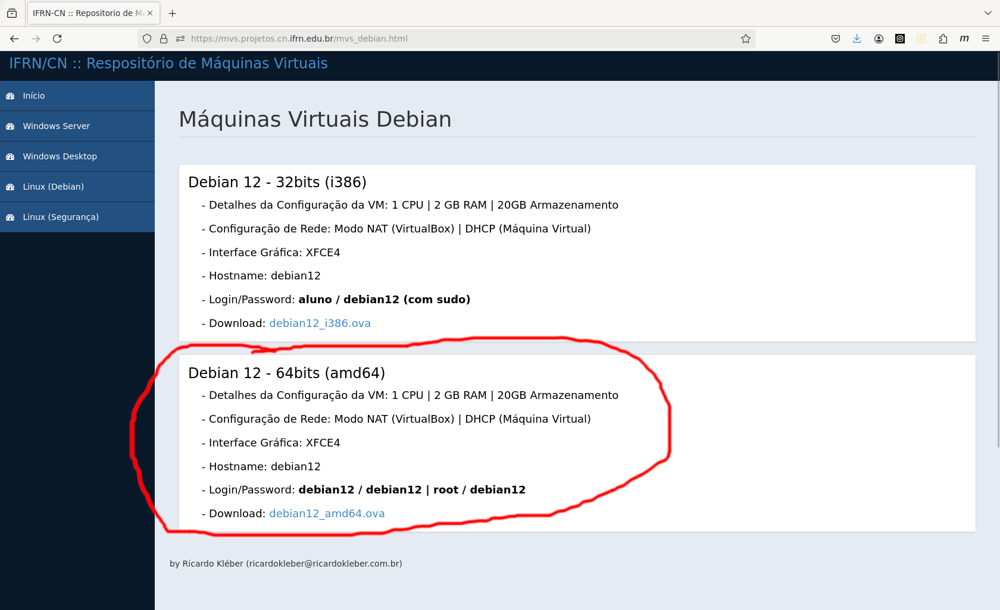
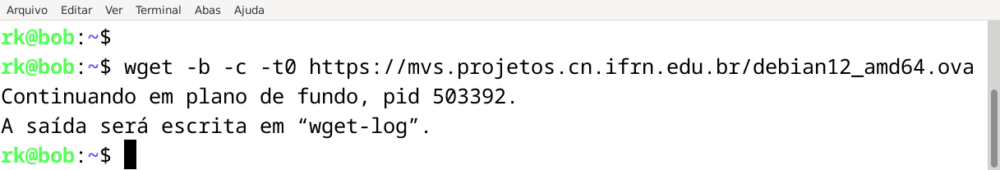
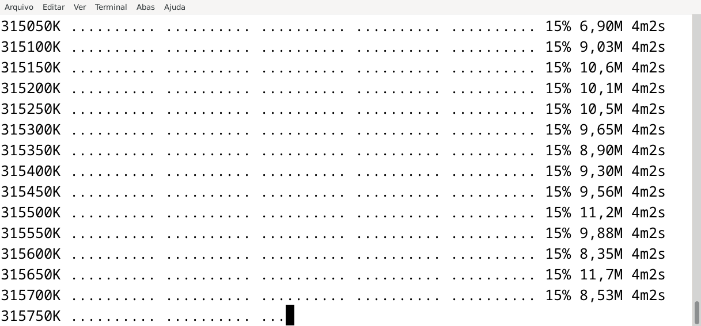
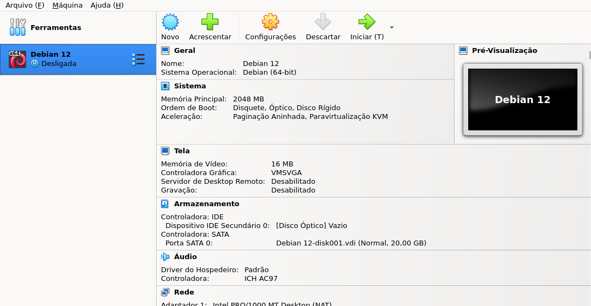
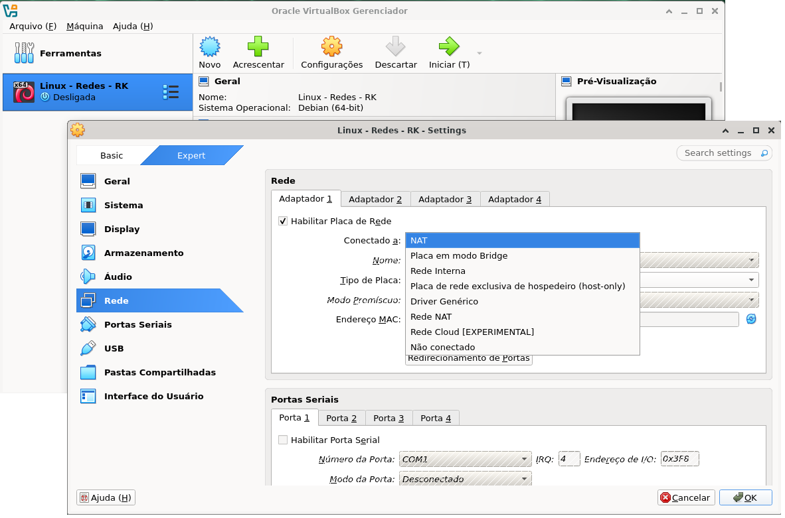

???+ note "Informações Gerais sobre a Disciplina/Turma:"

    * **Disciplina:** TEC.0678 - Redes de Computadores
    * **Turma em Andamento:** 20251.3.03806.361.1M
    * **Período de aulas desta turma/disciplina:** 07/04 a 15/08/2025
    * **Carga-Horária:** 60h (80 aulas)
    * **Professor:** Ricardo Kléber
    * **Aulas Semanais:** Terças e Quartas (10:30 as 12:00)
    * **Local:** Laboratório de Redes (D-18) | IFRN/CN
    * **E-Mail do Professor:** ricardokleber@ricardokleber.com.br

??? note "Programa da Disciplina"
    * **Curso:** Curso Superior de Tecnologia em Sistemas para Internet
    * **Disciplina:** Redes de Computadores
    * **Carga-Horária:** 60h (80h/a)
    * **Pré-Requisito(s):** Não Há
    * **Número de créditos:** 4

    **Ementa**

    Fundamentos de redes de computadores e a Internet; modelos RM-OSI e TCP/IP; camada física
    TCP/IP: funções e meios de transmissão; camadas de enlace TCP/IP: funcionamento de serviços,
    tecnologias, padrões de comunicação com fio e sem fio, dispositivos de interconexão; camada de rede
    TCP/IP: funcionamento de serviços e protocolos.

    **Objetivos**

    * Compreender conceitos de comunicação de dados em redes de computadores;
    * Diferenciar os modelos RM-OSI e TCP/IP;
    * Conhecer os componentes da Internet;
    * Compreender serviços e protocolos das camadas física, enlace e rede do modelo TCP/IP;
    * Conhecer tecnologias, padrões de comunicação e meios físicos de transmissão de dados com fio e sem fio.

    **Bases Científico-Tecnológicas (Conteúdos)**

    1. Fundamentos de redes de computadores
        1. Histórico;
        2. Classificação de redes;
        3. Componentes da Internet.
    2. Modelos de redes
        1. Modelo RM-OSI;
        2. Modelo TCP/IP.
    3. Camada Física
        1. Funções;
        2. Meios de transmissão de dados: Cabo coaxial;
        3. Meios de transmissão de dados: Cabo de par trançado;
        4. Meios de transmissão de dados: Fibra óptica.
    4. Camada de Enlace TCP/IP
        1. Serviços
        2. Tecnologias e padrões de comunicação com fio
        3. Tecnologias e padrões de comunicação sem fio
        4. Dispositivos de interconexão de redes
    5. Camada de Rede TCP/IP
        1. Serviços
        2. Endereçamento IPv4
        3. Fundamentos e configuração de protocolos de roteamento
        4. Funcionamento de protocolos ARP e ICMP
        5. Fundamentos e endereçamento IPv6

    **Procedimentos Metodológicos**

    Aulas teóricas expositivas, aulas práticas em laboratório, desenvolvimento de projetos, visitas técnicas.

    **Recursos Didáticos**

    Quadro branco e pincel; computador com acesso à Internet; projetor de multimídia; vídeos.

    **Avaliação**

    Avaliações escritas e práticas; trabalhos individuais e em grupo (listas de exercícios, estudos dirigidos pesquisas); apresentação dos trabalhos desenvolvidos; desenvolvimento de projetos.

    **Bibliografia Básica**

    1. KUROSE, J. F. & Ross, K. W. Redes de Computadores e a Internet: Uma Abordagem Top Down. ed. São Paulo: Pearson Education. 2013.
    2. TANENBAUM, Andrew S. et al. Redes de computadores. 5. ed. São Paulo: Pearson Prentice Hall, 582 p. il.
    3.  MARIN, Paulo Sérgio. Cabeamento estruturado: desvendando cada passo, do projeto à instalação. 4. ed. São Paulo: Érica, 2013. 336 p. il.

    **Bibliografia Complementar**

    1. LEA, Perry. Internet of Things for Architects: Architecting IoT solutions by implementing sensors communication infrastructure, edge computing, analytics, and security. Packt Publishing Ltd., 2018. 524 p. il.
    2. RAPPAPORT, Theodore S.; ALBINI, Luiz Carlos Pessoa. Comunicações sem fio: princípios e práticas. 2. ed. São Paulo: Pearson, 2009. 409 p. il.
    3. FILIPPETTI, Marco Aurélio. Cisco CCNA 4.1: (exame 640-802): guia de estudo completo. Florianópolis: Visual Books, 2008. 478 p. il.
    4. OLIVIERO, Andrew; WOODWARD, Bill. Cabling The Complete Guide to Copper and Fiber-Optic Networking. 5. ed, Sybex, 2014.
    5. FILHO, João Eriberto Mota. Análise de Tráfego em Redes TCP/IP. 1. ed. Novatec, 2013. 416 p. il.

    **Software(s) de Apoio:**

    * Sistema operacional com suporte a redes;
    * Software analisador de protocolos de redes;
    * Software com simulador de ativos de redes (switches e roteadores).

??? abstract "Apresentação da Disciplina"
    <div class="video-wrapper">
        <iframe src="https://docs.google.com/presentation/d/e/2PACX-1vQDKgu4naNR4WADTLHwbQaB9AKmuTLDwSYKJa_fiGNNGWy8SajRakELMASYDxF9aX88anYWt_O42Sml/embed?start=false&loop=false&delayms=3000" frameborder="0" width="1058" height="440" allowfullscreen="true" mozallowfullscreen="true" webkitallowfullscreen="true"></iframe>
    </div>

## 1. Bimestre

### 1. Fundamentos de Redes de Computadores

??? abstract "Slides"
    <div class="video-wrapper">
        <iframe src="https://docs.google.com/presentation/d/e/2PACX-1vTELLS3XYR2-Ipnamlw3_ZO15Tp8BshTlNqvSC23-qdfdJPbUEdFTour4YVoMgOI1VTLrszxUgC2GsF/embed?start=false&loop=false&delayms=3000" frameborder="0" width="1058" height="440" allowfullscreen="true" mozallowfullscreen="true" webkitallowfullscreen="true"></iframe>
    </div>

??? example "Videoaula: Fundamentos de Redes de Computadores (2021)"
    <div class="video-wrapper">
        <iframe width="560" height="315" src="https://www.youtube.com/embed/KuPKXBsJoro?si=SY8wLlHi-aEAG9gd" title="YouTube video player" frameborder="0" allow="accelerometer; autoplay; clipboard-write; encrypted-media; gyroscope; picture-in-picture; web-share" referrerpolicy="strict-origin-when-cross-origin" allowfullscreen></iframe>
    </div>

??? abstract "Leitura Recomendada"
    <ul>
        <li><a href="https://mvs.projetos.cn.ifrn.edu.br/livros/Tanenbaum_Cap01.pdf" target="_blank">Tanenbaum - Cap. 01</a></li>
        <ul>
            <li>1.1 -  Uso de Redes de Computadores</li>
            <li>1.2 -  Tipos de Redes de Computadores</li>
            <li>1.3 -  Tecnologia de Redes Locais a Globais</li>
            <li>1.4 -  Exemplos de Redes</li>
            <li>1.5 -  Protocolos de Rede</li>
        </ul>
    </ul>
    <ul>
        <li><a href="https://mvs.projetos.cn.ifrn.edu.br/livros/Forouzan_Cap01.pdf" target="_blank">Forouzan - Cap. 01</a></li>
        <ul>
            <li>1.1 -  Visão Geral da Internet</li>
            <li>1.3 -  História da Internet</li>
            <li>1.4 -  Padrões de Administração</li>
        </ul>
    </ul>
    <ul>
        <li><a href="https://mvs.projetos.cn.ifrn.edu.br/livros/Kurose_Cap01.pdf" target="_blank">Kurose - Cap. 01</a></li>
        <ul>
            <li>1.1 -  O que é a Internet?</li>
            <li>1.2 -  Periferia da Internet</li>
            <li>1.3 -  História das redes de computadores e da Internet</li>
        </ul>
    </ul>

### 2. Modelos de Redes

??? abstract "Slides"
    <div class="video-wrapper">
        <iframe src="https://docs.google.com/presentation/d/e/2PACX-1vQFWpHI5hisD20_UyHISzQT5uVEagWI-VMBceHQ4WIbgzvJWiK40QqMtkb3OoBueShhHlsIMuqm1VXl/pubembed?start=false&loop=false&delayms=3000" frameborder="0" width="1058" height="440" allowfullscreen="true" mozallowfullscreen="true" webkitallowfullscreen="true"></iframe>
    </div>

??? abstract "Leitura Recomendada"
    <ul>
        <li><a href="https://mvs.projetos.cn.ifrn.edu.br/livros/Tanenbaum_Cap01.pdf" target="_blank">Tanenbaum - Cap. 01</a></li>
        <ul>
            <li>1.6 -  Modelos de Referência - Redes de Computadores</li>
        </ul>
    </ul>
    <ul>
        <li><a href="https://mvs.projetos.cn.ifrn.edu.br/livros/Forouzan_Cap01.pdf" target="_blank">Forouzan - Cap. 01</a></li>
        <ul>
            <li>1.2 -  Protocolos em Camadas</li>
        </ul>
    </ul>
    <ul>
        <li><a href="https://mvs.projetos.cn.ifrn.edu.br/livros/Kurose_Cap01.pdf" target="_blank">Kurose - Cap. 01</a></li>
        <ul>
            <li>1.5 -  Camadas de Protocolos e Seus Modelos de Serviço</li>
        </ul>
    </ul>

### 3. Camada Física

??? abstract "Slides"
    <div class="video-wrapper">
        <iframe src="https://docs.google.com/presentation/d/e/2PACX-1vT2qYQk5O7ynq4t_6bnbhYlMM1gQuP5YPIHVQR-GDEKS-s9R3nvffzj9ubGmvEVYPN2ZFv503ucmyd9/pubembed?start=false&loop=false&delayms=3000" frameborder="0" width="1058" height="440" allowfullscreen="true" mozallowfullscreen="true" webkitallowfullscreen="true"></iframe>
    </div>

??? example "Videoaula: Camada Física (2021)"
    <div class="video-wrapper">
        <iframe width="560" height="315" src="https://www.youtube.com/embed/73jL8hLgs1k?si=UCebDhys5PZGXI6e" title="YouTube video player" frameborder="0" allow="accelerometer; autoplay; clipboard-write; encrypted-media; gyroscope; picture-in-picture; web-share" referrerpolicy="strict-origin-when-cross-origin" allowfullscreen></iframe>
    </div>

??? abstract "Leitura Recomendada"
    <ul>
        <li><a href="https://mvs.projetos.cn.ifrn.edu.br/livros/Tanenbaum_Cap02.pdf" target="_blank">Tanenbaum - Cap. 02</a></li>
        <ul>
            <li>2.1 -  Meios de Transmissão Guiados</li>
            <li>2.2 -  Transmissão sem Fio</li>
            <li>2.3 -  De formas de Onda a Bits</li>
        </ul>
    </ul>
    <ul>
        <li><a href="https://mvs.projetos.cn.ifrn.edu.br/livros/Forouzan_Cap07.pdf" target="_blank">Forouzan - Cap. 07</a></li>
        <ul>
            <li>7.1 -  Dados e Sinais</li>
            <li>7.2 -  Transmissão Digital</li>
            <li>7.3 -  Transmisão Analógica</li>
            <li>7.4 -  Utilização de Banda</li>
            <li>7.5 -  Meios de Transmissão</li>
        </ul>
    </ul>

### 4. Camada de Enlace TCP/IP

??? abstract "Serviços: Slides"
    <div class="video-wrapper">
        <iframe src="https://docs.google.com/presentation/d/e/2PACX-1vQbqKVoyS2eEJAQLTpNryrf6n8tSTr_FjipY9V2HcH8cjmFmNEvs-OgFl0H_2g0-bE6luo4BjtB2sRX/pubembed?start=false&loop=false&delayms=3000" frameborder="0" width="1058" height="440" allowfullscreen="true" mozallowfullscreen="true" webkitallowfullscreen="true"></iframe>
    </div>

??? abstract "Tecnologias e Padrões de Comunicação com Fio: Slides"
    <div class="video-wrapper">
        <iframe src="https://docs.google.com/presentation/d/e/2PACX-1vSWyiQKu9_LkWHWXK9uVpCbD0h-3yaxJVYue12tmOvzCZNskonF1ec1WwtfatCV6qafT2LYHygwxdz4/pubembed?start=false&loop=false&delayms=3000" frameborder="0" width="1058" height="440" allowfullscreen="true" mozallowfullscreen="true" webkitallowfullscreen="true"></iframe>
    </div>

??? note "[Roteiro] Aula Prática: Máquina Virtual (Linux Debian 12) para Práticas em Ambiente Controlado"

    **Instalando uma Máquina Virtual (Linux Debian 12) para Práticas em Ambiente Controlado**

    <p>
    Para ter pleno acesso ao sistema (inclusive como superusuário 'root') utilizaremos uma máquina virtual (VirtualBox) já devidamente configurada, evitando a necessidade de instalação completa do sistema.
    </p>
    <p>
    ATENÇÃO!!! Certifique-se que o Virtualbox está instalado na máquina. Caso contrário, basta instalar seguindo as orientações do site da ferramenta (para qualquer sistema operacional) www.virtualbox.org.
    </p>
    <p>
    Baixe o Appliance Virtualbox 'Debian 12 - 64bits (amd64)' disponível no servidor de Máquinas Virtuais do Campus
    </p>
    

    ```
    wget -b -c -t0 https://mvs.projetos.cn.ifrn.edu.br/debian12_amd64.ova
    ```
    
    <p>
    Acompanhe em tempo real o download do arquivo utilizando o comando `tail` com o parâmetro `-f` para exibir o conteúdo do arquivo `wget.log` onde o `wget` escreve os logs do andamento do donwload. Ao final do processo (100% do download) ou a qualquer momento para parar a visualização digite `CTRL+C`
    </p>
    ```
    tail -f wget.log
    ```
    
    <p>
    Quando terminar o donwload, basta utilizar o Gerenciador de Arquivos do seu sistema operacional (Windows ou Linux) e dar 'dois cliques' no arquivo .OVA. O sistema operacional vai identificar que se trata de um arquivo do VirtualBox e iniciará o carregamento e instalação normalmente (bastando clicar em 'Finalizar'). Aguarde o progresso da importação do appliance e, ao final, a máquina virtual está pronta para ser utilizada.

    
    </p>
    <p>
    Antes de Iniciar sua Máquina Virtual Linux Debian 12, verifique se a configuração de rede da MV no VirtualBox está indicando que a placa de rede está no modo 'NAT'.
    </p>
    

??? note "[Roteiro] Aula Prática: Captura e Análise de Tráfego ARP (Tcpdump + Wireshark)"

    Etapa 1: Preparação do Ambiente

    Verifique a instalação do tcpdump: Abra o terminal do seu sistema operacional e execute o seguinte comando:

    ```tcpdump --version```

    Se o tcpdump estiver instalado, você verá informações sobre a versão. Caso contrário, será necessário instalá-lo utilizando o gerenciador de pacotes da sua distribuição Linux (apt-get install tcpdump no Debian/Ubuntu).

    Identifique a interface de rede: Utilize o comando abaixo para listar as interfaces de rede disponíveis no seu sistema:
   
    ```ip a```

    Procure pela interface que está conectada à sua rede local (geralmente eth0, en0, wlan0, etc.). Anote o nome dessa interface, pois a utilizaremos na captura.

    Prepare-se para gerar tráfego ARP: Para que possamos capturar pacotes ARP significativos, será necessário gerar alguma atividade na rede que envolva a resolução de endereços MAC para endereços IP. Algumas ações que podem gerar tráfego ARP incluem:
        - Pingar um dispositivo na sua rede local pelo endereço IP (um dispositivo que você ainda não pingou recentemente).
        - Tentar acessar um recurso compartilhado em outro computador da rede.
        - Conectar um novo dispositivo à rede. 
    
    Etapa 2: Captura de Pacotes ARP com tcpdump
    
    Execute o tcpdump para capturar pacotes ARP: Abra um novo terminal e execute o seguinte comando, substituindo <interface> pelo nome da interface de rede identificada na Etapa 1:

    ```tcpdump -i <interface> -w arp.pcap arp```

        - i <interface>: Especifica a interface de rede para captura. 
        - w arp.pcap: Indica que os pacotes capturados devem ser gravados em um arquivo chamado arp.pcap. 
        - arp: Filtra o tráfego, capturando apenas pacotes do protocolo ARP. 
    
    Gere tráfego ARP: Em outro terminal ou em outro dispositivo na rede, realize uma das ações mencionadas na Etapa 1 para gerar tráfego ARP. Por exemplo, pingue um endereço IP de um dispositivo na sua rede local:

    ```ping <endereço_ip_de_outro_dispositivo>```
    
    Aguarde alguns segundos: Deixe o tcpdump rodando por alguns segundos para capturar alguns pacotes ARP relevantes.
    
    Interrompa a captura: Pressione Ctrl + C no terminal onde o tcpdump está sendo executado para interromper a captura e salvar os pacotes no arquivo arp.pcap.
   
    Etapa 3: Análise do Tráfego Capturado com Wireshark

    Abra o Wireshark: Inicie o aplicativo Wireshark no seu computador.
    
    Abra o arquivo de captura: No Wireshark, vá em "Arquivo" (File) -> "Abrir" (Open) e selecione o arquivo arp.pcap que você salvou na Etapa 2.
   
    Filtre por ARP (opcional, mas recomendado): Se outros protocolos foram capturados acidentalmente, você pode aplicar um filtro para visualizar apenas os pacotes ARP. Na barra de filtros do Wireshark, digite arp e pressione Enter.
   
    Selecione um pacote ARP: Clique em um dos pacotes ARP listados na janela superior do Wireshark para visualizar os detalhes do pacote nas janelas inferiores.
   
    Analise o cabeçalho ARP: Na janela do meio ("Packet Details"), procure pela seção "Address Resolution Protocol". Expanda essa seção para visualizar os campos do cabeçalho ARP.
   
    Etapa 4: Responda às Perguntas sobre os Campos do Cabeçalho ARP

    Com base na sua análise do arquivo arp.pcap no Wireshark, responda às seguintes perguntas para pelo menos um dos pacotes ARP capturados:

    - Hardware Type (Tipo de Hardware): Qual o valor deste campo e o que ele representa? 

    - Protocol Type (Tipo de Protocolo): Qual o valor deste campo e a qual protocolo de camada de rede ele se refere?
   
    - Hardware Address Length (Tamanho do Endereço de Hardware): Qual o valor deste campo e qual o tamanho em bytes de um endereço MAC Ethernet?
    
    - Protocol Address Length (Tamanho do Endereço de Protocolo): Qual o valor deste campo e qual o tamanho em bytes de um endereço IPv4? 

    - Opcode (Código de Operação): Qual o valor deste campo e o que ele indica (Request ou Reply)? 

    - Sender MAC Address (Endereço MAC do Remetente): Qual o endereço MAC de quem enviou a mensagem ARP? 

    - Sender IP Address (Endereço IP do Remetente): Qual o endereço IP de quem enviou a mensagem ARP? 

    - Target MAC Address (Endereço MAC do Destinatário): Qual o endereço MAC de quem é o destinatário da mensagem ARP? (Em um ARP Request, este campo geralmente contém zeros) 

    - Target IP Address (Endereço IP do Destinatário): Qual o endereço IP de quem é o destinatário da mensagem ARP? 

    Observe a diferença entre um pacote ARP Request e um ARP Reply. Os valores dos campos, especialmente o Opcode e o Target MAC Address, serão diferentes.

??? abstract "Tecnologias e Padrões de Comunicação sem Fio: Slides"
    <div class="video-wrapper">
        <iframe src="https://docs.google.com/presentation/d/e/2PACX-1vQsL33aUeoAMSx3HHGjMOQg-gxa_qlKrbc5cj_FEQNCBZHu9PtNF7lSpcu1hu6jOg0Ork4t9Pw-OE1a/pubembed?start=false&loop=false&delayms=3000" frameborder="0" width="1058" height="440" allowfullscreen="true" mozallowfullscreen="true" webkitallowfullscreen="true"></iframe>
    </div>

??? abstract "[Slides] Prática em Laboratório: Monitoramento, Captura e Análise de Tráfego WiFi"
    <div class="video-wrapper">
        <iframe src="https://docs.google.com/presentation/d/e/2PACX-1vRElmJ42Ma6Nw7G0tUz489Fwz5D6U0rxyZdGtP8Zew7nqGY3rFjioxr7eNn4iQITNGfWbwOf-luYymN/pubembed?start=false&loop=false&delayms=3000" frameborder="0" width="1058" height="440" allowfullscreen="true" mozallowfullscreen="true" webkitallowfullscreen="true"></iframe>
    </div>

## 2. Bimestre

### 5. Camada de Rede TCP/IP
??? abstract "Slides"
    <div class="video-wrapper">
        <iframe src="https://docs.google.com/presentation/d/e/2PACX-1vTdZ6MDYfzvCGd0YGaHjo931ECUxJGBeBKcSEoRrJtTd-WMtx_s3dfOjYg0n7-AnATWSRCfbbGQHWa1/pubembed?start=false&loop=false&delayms=3000" frameborder="0" width="1058" height="440" allowfullscreen="true" mozallowfullscreen="true" webkitallowfullscreen="true"></iframe>
    </div>

??? note "Lista de Exercícios de Fixação - IPv4"

    01\. Complemente a tabela a seguir, conforme modelo sugerido na primeira linha:

    | Endereço IP | Classe | Prefixo em Decimal | Prefixo em Binário |
    | :---: | :---: | :---: | :---: |
    | 10.9.0.1 | A | 10 | 00001010 |
    | 192.168.0.1 |  |  |  |
    | 200.17.112.2 |  |  |  |
    | 120.112.40.254 |  |  |  |
    | 189.45.1.27 |  |  |  |
    | 172.17.3.12 |  |  |  |

    02\. Complemente a tabela a seguir, conforme modelo sugerido na primeira linha:

    | Endereço IP | Classe | No Endereços IP | Endereço de Rede | Endereço Broadcast |
    | :---: | :---: | :---: | :---: | :---: |
    | 10.9.0.1 | A | 2^24 = 16777216 | 10.0.0.0 | 10.255.255.255 |
    | 111.111.11.1 |  |  |  |  |
    | 222.222.22.2 |  |  |  |  |
    | 39.21.4.3 |  |  |  |  |
    | 175.14.255.3 |  |  |  |  |
    | 1.1.1.1 |  |  |  |  |

    03\. Considerando, apenas, o conceito de classes de endereçamento, marque (S)im ou (N)ão indicando se os endereços IP estão na mesma rede:

    - 10.1.2.3 e 10.5.120.1
    - 1.2.3.4 e 5.6.7.8
    - 200.1.2.3 e 200.17.112.2
    - 168.52.56.24 e 168.65.44.33
    - 192.168.0.1 e 192.168.1.2
    - 13.53.65.32 e 200.2.55.3
    - 172.16.3.2 e 172.16.3.0
    - 10.17.3.4 e 10.18.32.56
    - 201.45.23.23 e 201.1.1.1
    - 220.220.1.1 e 220.220.1.2

    04\. Qual a faixa reservada para endereçamentos privados IPv4 destinada a testes (loopback)?

    05\. Dê 2 exemplos de endereços IPv4, que são endereços privados e 2 exemplos de endereços Ipv4 que NÃO são endereços privados.

    06\. Quantos IPs diferentes possui uma rede com prefixo de 30 bits?

    07\. Quantos bits tem o sufixo de um endereço IPv4 de Classe B?

    08\. Considerando, apenas o conceito de classes de endereçamento, considere a situação em que um administrador recebeu a faixa de IPs 192.168.0.0 a 192.168.0.255 e precisa definir os IPs que estão disponíveis (e os que não são) para fazer a configuração dos equipamentos. Responda:

    - Endereço de REDE da REDE:
    - Endereço BROADCAST da rede:
    - IPs disponíveis (intervalo) para os hosts da rede:

    09\. Qual o endereço broadcast da rede a qual pertence o host 10.10.10.10/16?

    10\. Qual o Endereço de Broadcast da rede onde está localizado o host 162.168.10.44/255.255.0.0?

    11\. Quantos bits tem o sufixo da sub-rede a qual pertence o host 200.17.34.123/255.255.255.192?

    12\. Um administrador após receber um bloco de endereços 192.168.10.0/24, deseja dividi-lo em 4 sub-redes de igual tamanho, utilizando todo o bloco. Qual a máscara de cada uma dessas novas sub-redes?

    13\. Um administrador recebeu, para utilizar na rede sob sua responsabilidade, a faixa de endereços IP 10.10.0.0/16. Considerando que ele decidiu por distribuir esses endereços em 256 sub-redes de mesmo tamanho responda (após essa distribuição):  
    a) Qual a máscara dessas sub-redes?  
    b) Quantos IPs terão cada sub-rede?  
    c) Qual o endereço de rede da primeira sub-rede?  
    d) Qual o endereço de broadcast da primeira sub-rede?  
    e) Quantos bits terá o sufixo de cada sub-rede? 

    14\. Considere a situação em que um administrador recebeu a faixa de IPs (Sub-Rede) 100.100.100.0/255.255.255.128 e precisa dividi-la em 2 (duas) sub-redes de mesmo tamanho. Responda (para cada uma das 2 sub-redes resultantes):

    - Máscara de Rede da Sub-Rede (em número de bits e em notação decimal pontilhada);
    - Endereço de Rede da Sub-Rede;
    - Endereço de Broadcast da Sub-Rede
    - Número de Endereços disponíveis para hosts.

    15\. Considere a situação em que um administrador recebeu a faixa de IPs (Sub-Rede) 10.17.0.0/255.255.255.0 e precisa acomodar 3 sub-redes, sendo a primeira com 100 hosts,  e as duas outras com 50 hosts (cada). Responda (para cada uma das 3 sub-redes resultantes):

    - Máscara de Rede da Sub-Rede (em número de bits e em notação decimal pontilhada);
    - Endereço de Rede da Sub-Rede;
    - Endereço de Broadcast da Sub-Rede;
    - Número de Endereços disponíveis para hosts.

    16\. Considere a situação em que um administrador recebeu a faixa de IPs (Sub-Rede) 1.2.3.0/255.255.255.0 e precisa acomodar 3 sub-redes, sendo a primeira com 128 hosts,  e as duas outras com 60 hosts (cada). Responda (para cada uma das 3 sub-redes resultantes):

    - Máscara de Rede da Sub-Rede (em número de bits e em notação decimal pontilhada);
    - Endereço de Rede da Sub-Rede;
    - Endereço de Broadcast da Sub-Rede;
    - Número de Endereços disponíveis para hosts.

    17\. Considere a situação em que um administrador recebeu a faixa de IPs (Sub-Rede) 100.100.100.0/255.255.255.128 e precisa dividi-la em 2 (duas) sub-redes de mesmo tamanho. Responda (para cada uma das 2 sub-redes resultantes):

    - Máscara de Rede da Sub-Rede (em número de bits e em notação decimal pontilhada);
    - Endereço de Rede da Sub-Rede;
    - Endereço de Broadcast da Sub-Rede;
    - Número de Endereços disponíveis para hosts.

    18\. Considere a situação em que um administrador recebeu a faixa de IPs (Sub-Rede) 10.17.0.0/255.255.255.0 e precisa acomodar 3 sub-redes, sendo a primeira com 100 hosts,  e as duas outras com 50 hosts (cada). Responda (para cada uma das 3 sub-redes resultantes):

    - Máscara de Rede da Sub-Rede (em número de bits e em notação decimal pontilhada);
    - Endereço de Rede da Sub-Rede;
    - Endereço de Broadcast da Sub-Rede;
    - Número de Endereços disponíveis para hosts.

    19\. Considere a situação em que um administrador recebeu a faixa de IPs (Sub-Rede) 1.2.3.0/255.255.255.0 e precisa acomodar 3 sub-redes, sendo a primeira com 128 hosts,  e as duas outras com 60 hosts (cada). Responda (para cada uma das 3 sub-redes resultantes):

    - Máscara de Rede da Sub-Rede (em número de bits e em notação decimal pontilhada);
    - Endereço de Rede da Sub-Rede;
    - Endereço de Broadcast da Sub-Rede;
    - Número de Endereços disponíveis para hosts.