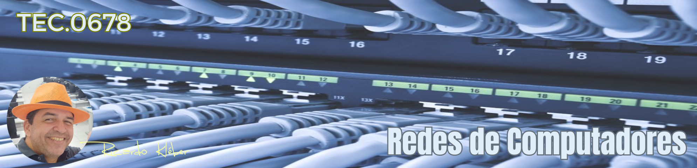

???+ note "Informações Gerais sobre a Disciplina/Turma:"

    * **Disciplina:** TEC.0678 - Redes de Computadores
    * **Turma em Andamento:** 20251.3.03806.361.1M
    * **Período de aulas desta turma/disciplina:** 07/04 a 15/08/2025
    * **Carga-Horária:** 60h (80 aulas)
    * **Professor:** Ricardo Kléber
    * **Aulas Semanais:** Terças e Quartas (10:30 as 12:00)
    * **Local:** Laboratório de Redes (D-18) | IFRN/CN
    * **E-Mail do Professor:** ricardokleber@ricardokleber.com.br

??? note "Programa da Disciplina"
    * **Curso:** Curso Superior de Tecnologia em Sistemas para Internet
    * **Disciplina:** Redes de Computadores
    * **Carga-Horária:** 60h (80h/a)
    * **Pré-Requisito(s):** Não Há
    * **Número de créditos:** 4

    **Ementa**

    Fundamentos de redes de computadores e a Internet; modelos RM-OSI e TCP/IP; camada física
    TCP/IP: funções e meios de transmissão; camadas de enlace TCP/IP: funcionamento de serviços,
    tecnologias, padrões de comunicação com fio e sem fio, dispositivos de interconexão; camada de rede
    TCP/IP: funcionamento de serviços e protocolos.

    **Objetivos**

    * Compreender conceitos de comunicação de dados em redes de computadores;
    * Diferenciar os modelos RM-OSI e TCP/IP;
    * Conhecer os componentes da Internet;
    * Compreender serviços e protocolos das camadas física, enlace e rede do modelo TCP/IP;
    * Conhecer tecnologias, padrões de comunicação e meios físicos de transmissão de dados com fio e sem fio.

    **Bases Científico-Tecnológicas (Conteúdos)**

    1. Fundamentos de redes de computadores
        1. Histórico;
        2. Classificação de redes;
        3. Componentes da Internet.
    2. Modelos de redes
        1. Modelo RM-OSI;
        2. Modelo TCP/IP.
    3. Camada Física
        1. Funções;
        2. Meios de transmissão de dados: Cabo coaxial;
        3. Meios de transmissão de dados: Cabo de par trançado;
        4. Meios de transmissão de dados: Fibra óptica.
    4. Camada de Enlace TCP/IP
        1. Serviços
        2. Tecnologias e padrões de comunicação com fio
        3. Tecnologias e padrões de comunicação sem fio
        4. Dispositivos de interconexão de redes
    5. Camada de Rede TCP/IP
        1. Serviços
        2. Endereçamento IPv4
        3. Fundamentos e configuração de protocolos de roteamento
        4. Funcionamento de protocolos ARP e ICMP
        5. Fundamentos e endereçamento IPv6

    **Procedimentos Metodológicos**

    Aulas teóricas expositivas, aulas práticas em laboratório, desenvolvimento de projetos, visitas técnicas.

    **Recursos Didáticos**

    Quadro branco e pincel; computador com acesso à Internet; projetor de multimídia; vídeos.

    **Avaliação**

    Avaliações escritas e práticas; trabalhos individuais e em grupo (listas de exercícios, estudos dirigidos pesquisas); apresentação dos trabalhos desenvolvidos; desenvolvimento de projetos.

    **Bibliografia Básica**

    1. KUROSE, J. F. & Ross, K. W. Redes de Computadores e a Internet: Uma Abordagem Top Down. ed. São Paulo: Pearson Education. 2013.
    2. TANENBAUM, Andrew S. et al. Redes de computadores. 5. ed. São Paulo: Pearson Prentice Hall, 582 p. il.
    3.  MARIN, Paulo Sérgio. Cabeamento estruturado: desvendando cada passo, do projeto à instalação. 4. ed. São Paulo: Érica, 2013. 336 p. il.

    **Bibliografia Complementar**

    1. LEA, Perry. Internet of Things for Architects: Architecting IoT solutions by implementing sensors communication infrastructure, edge computing, analytics, and security. Packt Publishing Ltd., 2018. 524 p. il.
    2. RAPPAPORT, Theodore S.; ALBINI, Luiz Carlos Pessoa. Comunicações sem fio: princípios e práticas. 2. ed. São Paulo: Pearson, 2009. 409 p. il.
    3. FILIPPETTI, Marco Aurélio. Cisco CCNA 4.1: (exame 640-802): guia de estudo completo. Florianópolis: Visual Books, 2008. 478 p. il.
    4. OLIVIERO, Andrew; WOODWARD, Bill. Cabling The Complete Guide to Copper and Fiber-Optic Networking. 5. ed, Sybex, 2014.
    5. FILHO, João Eriberto Mota. Análise de Tráfego em Redes TCP/IP. 1. ed. Novatec, 2013. 416 p. il.

    **Software(s) de Apoio:**

    * Sistema operacional com suporte a redes;
    * Software analisador de protocolos de redes;
    * Software com simulador de ativos de redes (switches e roteadores).

??? abstract "Apresentação da Disciplina"
    

        <iframe src="https://docs.google.com/presentation/d/e/2PACX-1vQDKgu4naNR4WADTLHwbQaB9AKmuTLDwSYKJa_fiGNNGWy8SajRakELMASYDxF9aX88anYWt_O42Sml/embed?start=false&loop=false&delayms=3000" frameborder="0" width="1058" height="440" allowfullscreen="true" mozallowfullscreen="true" webkitallowfullscreen="true"></iframe>
    

## 1. Bimestre

### 1. Fundamentos de Redes de Computadores

??? abstract "Slides"
    

        <iframe src="https://docs.google.com/presentation/d/e/2PACX-1vTELLS3XYR2-Ipnamlw3_ZO15Tp8BshTlNqvSC23-qdfdJPbUEdFTour4YVoMgOI1VTLrszxUgC2GsF/embed?start=false&loop=false&delayms=3000" frameborder="0" width="1058" height="440" allowfullscreen="true" mozallowfullscreen="true" webkitallowfullscreen="true"></iframe>
    

??? example "Videoaula: Fundamentos de Redes de Computadores (2021)"
    

        <iframe width="560" height="315" src="https://www.youtube.com/embed/KuPKXBsJoro?si=SY8wLlHi-aEAG9gd" title="YouTube video player" frameborder="0" allow="accelerometer; autoplay; clipboard-write; encrypted-media; gyroscope; picture-in-picture; web-share" referrerpolicy="strict-origin-when-cross-origin" allowfullscreen></iframe>
    

??? abstract "Leitura Recomendada"
    <ul>
        <li><a href="https://mvs.projetos.cn.ifrn.edu.br/livros/Tanenbaum_Cap01.pdf" target="_blank">Tanenbaum - Cap. 01</a></li>
        <ul>
            <li>1.1 -  Uso de Redes de Computadores</li>
            <li>1.2 -  Tipos de Redes de Computadores</li>
            <li>1.3 -  Tecnologia de Redes Locais a Globais</li>
            <li>1.4 -  Exemplos de Redes</li>
            <li>1.5 -  Protocolos de Rede</li>
        </ul>
    </ul>
    <ul>
        <li><a href="https://mvs.projetos.cn.ifrn.edu.br/livros/Forouzan_Cap01.pdf" target="_blank">Forouzan - Cap. 01</a></li>
        <ul>
            <li>1.1 -  Visão Geral da Internet</li>
            <li>1.3 -  História da Internet</li>
            <li>1.4 -  Padrões de Administração</li>
        </ul>
    </ul>

### 2. Modelos de Redes

??? abstract "Slides"
    

        <iframe src="https://docs.google.com/presentation/d/e/2PACX-1vQFWpHI5hisD20_UyHISzQT5uVEagWI-VMBceHQ4WIbgzvJWiK40QqMtkb3OoBueShhHlsIMuqm1VXl/pubembed?start=false&loop=false&delayms=3000" frameborder="0" width="1058" height="440" allowfullscreen="true" mozallowfullscreen="true" webkitallowfullscreen="true"></iframe>
    

??? abstract "Leitura Recomendada"
    <ul>
        <li><a href="https://mvs.projetos.cn.ifrn.edu.br/livros/Tanenbaum_Cap01.pdf" target="_blank">Tanenbaum - Cap. 01</a></li>
        <ul>
            <li>1.6 -  Modelos de Referência - Redes de Computadores</li>
        </ul>
    </ul>
    <ul>
        <li><a href="https://mvs.projetos.cn.ifrn.edu.br/livros/Forouzan_Cap01.pdf" target="_blank">Forouzan - Cap. 01</a></li>
        <ul>
            <li>1.2 -  Protocolos em Camadas</li>
        </ul>
    </ul>

### 3. Camada Física

??? abstract "Slides"
    

        <iframe src="https://docs.google.com/presentation/d/e/2PACX-1vT2qYQk5O7ynq4t_6bnbhYlMM1gQuP5YPIHVQR-GDEKS-s9R3nvffzj9ubGmvEVYPN2ZFv503ucmyd9/pubembed?start=false&loop=false&delayms=3000" frameborder="0" width="1058" height="440" allowfullscreen="true" mozallowfullscreen="true" webkitallowfullscreen="true"></iframe>
    

??? example "Videoaula: Camada Física (2021)"
    

        <iframe width="560" height="315" src="https://www.youtube.com/embed/73jL8hLgs1k?si=UCebDhys5PZGXI6e" title="YouTube video player" frameborder="0" allow="accelerometer; autoplay; clipboard-write; encrypted-media; gyroscope; picture-in-picture; web-share" referrerpolicy="strict-origin-when-cross-origin" allowfullscreen></iframe>
    

??? abstract "Leitura Recomendada"
    <ul>
        <li><a href="https://mvs.projetos.cn.ifrn.edu.br/livros/Tanenbaum_Cap02.pdf" target="_blank">Tanenbaum - Cap. 02</a></li>
        <ul>
            <li>2.1 -  Meios de Transmissão Guiados</li>
            <li>2.2 -  Transmissão sem Fio</li>
            <li>2.3 -  De formas de Onda a Bits</li>
        </ul>
    </ul>
    <ul>
        <li><a href="https://mvs.projetos.cn.ifrn.edu.br/livros/Forouzan_Cap07.pdf" target="_blank">Forouzan - Cap. 07</a></li>
        <ul>
            <li>7.1 -  Dados e Sinais</li>
            <li>7.2 -  Transmissão Digital</li>
            <li>7.3 -  Transmisão Analógica</li>
            <li>7.4 -  Utilização de Banda</li>
            <li>7.5 -  Meios de Transmissão</li>
        </ul>
    </ul>

### 4. Camada de Enlace TCP/IP

## 2. Bimestre

### 5. Camada de Rede TCP/IP