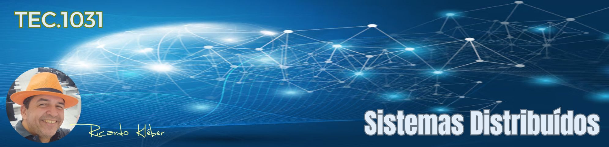

???+ note "Informações Gerais sobre a Disciplina/Turma:"

    * **Disciplina:** TEC.1031 - Sistemas Distribuídos
    * **Turma em Andamento:** 20252.4.03806.361.1M
    * **Período de aulas desta turma/disciplina:** 09/09/2025 a 10/02/2026
    * **Carga-Horária:** 30h (40 aulas)
    * **Professor:** Ricardo Kléber
    * **Aulas Semanais:** Terças (08:50 as 10:20)
    * **Local:** Laboratório de Redes (D-18) | IFRN/CN
    * **E-Mail do Professor:** ricardokleber@ricardokleber.com.br

??? note "Programa da Disciplina"
    * **Curso:** Curso Superior de Tecnologia em Sistemas para Internet
    * **Disciplina:** Sistemas Distribuídos
    * **Carga-Horária:** 30h (40h/a)
    * **Pré-Requisito(s):** --
    * **Número de créditos:** 2

    **Ementa**

    Conceituação e caracterização de processos; conceituação e caracterização da comunicação entre processos e de aspectos envolvidos no projeto de sistemas distribuídos; conceituação e caracterização dos principais modelos de comunicação e estudo de tópicos relacionados à sincronização em sistemas distribuídos; conceituação e caracterização dos principais serviços utilizados em sistemas distribuídos.

    **Objetivos**

    * Apresentar os principais tópicos relacionados a Sistemas Distribuídos;
    * Habilitar o aluno a desenvolver uma aplicação simples, de forma distribuída, utilizando os conceitos e ferramentas discutidos na disciplina.

    **Bases Científico-Tecnológicas (Conteúdos)**

    1. Processos
        1. Introdução ao conceito de processo;
        2. Condições de corrida;
        3. Regiões críticas;
        4. Exclusão mútua;
        5. Semáforos;
        6. Troca de mensagens.    
    2. Introdução aos Sistemas Distribuídos
        1. Objetivos;
        2. Aspectos de projeto:
            1.Transparência;
            2.Flexibilidade;
            3.Confiabilidade;
            4.Performance.
        3. Escalabilidade.
    3. Comunicação nos sistemas distribuídos
        1. Modelo cliente-servidor;
        2. Introdução aos protocolos da Internet;
        3. Chamara remota a procedimentos;
        4. RMI (Remote Method Invocation);
        5. Sockets.
    4. Sincronização em Sistemas Distribuídos
        1. Sincronização através de clock;
        2. Exclusão mútua;
        3. Algoritmos eletivos;
        4. Transações atômicas;
        5. Deadlocks.
    5. Suporte a Threads
        1. Conceitos;
        2. Multithreading.
    6. Serviços de nomes e diretórios distribuídos
    7. Sistemas de arquivos distribuídos
    8. Componentes para computação distribuída

    **Procedimentos Metodológicos**

    Aulas teóricas expositivas; aulas práticas em laboratório; desenvolvimento de projetos; leitura de textos, palestras, seminários, visitas técnicas, pesquisas bibliográficas.

    **Recursos Didáticos**

    Livros, leitura de textos, manuais, palestras, seminários, pesquisas bibliográficas; quadro branco, computador, projetor multimídia, vídeos.

    **Avaliação**

    Avaliações escritas e práticas; trabalhos individuais e em grupo (lista de exercícios, estudos dirigidos, pesquisas); apresentação dos trabalhos desenvolvidos na forma de seminários.

    **Bibliografia Básica**

    1. TANENBAUM, Andrew S.; STEEN, Maarten Van; MARQUES, Arlete Simille. Sistemas distribuídos: princípios e paradigmas. 2. ed. São Paulo: Pearson Prentice Hall, 2007. 402 p. il.
    2. COULOURIS, G et al. Sistemas Distribuídos: Conceitos e Projetos. 5. ed. Porto Alegre: Bookman, 2013. 1048 p. il.
    3. PACHECO, Peter. An introduction to parallel programming. Elsevier, 2011.

    **Bibliografia Complementar**

    1. ARUNDEL, John; DOMINGUS. DevOps nativo de nuvem com Kubernets. São Paulo: Novatec Editora LTDA. 2019
    2. STEVENS, R. W. Programação de rede UNIX: API para soquetes de rede. Porto Alegre: Bookman.
    3. FOROUZAN, B. Comunicação de Dados e Redes de Computadores. Porto Alegre: Bookman.
    4. ROSS, K.; KUROSE, J. Redes de Computadores e a Internet: uma nova abordagem. São Paulo: Addison Wesley.
    5. HWANG, Kai; DONGARRA, Jack; FOX, Geoffrey C. Distributed and cloud computing: from parallel processing to the internet of things. Morgan Kaufmann, 2013.

    **Software(s) de Apoio:**

    * Sistema Operacional Windows e Linux;
    Linguagem de programação com suporte a sockets;
    Linguagem de programação com suporte a chamada remota de procedimentos.

??? abstract "Apresentação da Disciplina"
    

        <iframe src="https://docs.google.com/presentation/d/e/2PACX-1vSE5wRkFFyfLXMIDXxwzzDuD2ZAdhk2yCg1nVa7QNFR3_6EEPGDATQFO2qqx4ui5jygnK_P63M5zI7B/pubembed?start=false&loop=false&delayms=3000" frameborder="0" width="1058" height="440" allowfullscreen="true" mozallowfullscreen="true" webkitallowfullscreen="true"></iframe>
    

## 1. Bimestre

### 1. Processos

#### 1.1. Introdução ao conceito de processo
#### 1.2. Condições de corrida;
#### 1.3. Regiões críticas;
#### 1.4. Exclusão mútua;
#### 1.5. Semáforos;
#### 1.6. Troca de mensagens.

??? abstract "Slides"
    

        <iframe src="https://docs.google.com/presentation/d/e/2PACX-1vS9XhE-QnfmteNpFm5r4xp0xXI7hU18rXkmpPT18N1JQZ2uXqcf0D8ospb8BZ1UPz09pB4im5MCICYd/pubembed?start=false&loop=false&delayms=3000" frameborder="0" width="1058" height="440" allowfullscreen="true" mozallowfullscreen="true" webkitallowfullscreen="true"></iframe>
    

### 2. Introdução aos Sistemas Distribuídos

#### 2.1. Objetivos;
#### 2.2. Aspectos de projeto: Transparência; Flexibilidade; Confiabilidade; Performance; e Escalabilidade.

??? abstract "Slides"
    

        <iframe src="https://docs.google.com/presentation/d/e/2PACX-1vTEXFEVuR-7LpTBzRerg2Sfy8jtgtoybyaL-W7LeiAf9BhAdU_cOd3kn1oxy4gOPzsyZXt3lao47y8V/pubembed?start=false&loop=false&delayms=3000" frameborder="0" width="1058" height="440" allowfullscreen="true" mozallowfullscreen="true" webkitallowfullscreen="true"></iframe>
    

### 3. Comunicação nos sistemas distribuídos

#### 3.1. Modelo cliente-servidor;
??? abstract "Slides"
    

        <iframe src="https://docs.google.com/presentation/d/e/2PACX-1vSabySzVdW1f5HIdOY57p_8aSM3Zyd1RtdgMuOxZFh3fVC3zcRjM5Pyh5Mwio9nRKpZFv3XOHXwHK_n/pubembed?start=false&loop=false&delayms=3000" frameborder="0" width="1058" height="440" allowfullscreen="true" mozallowfullscreen="true" webkitallowfullscreen="true"></iframe>
    

#### 3.2. <del>Introdução aos protocolos da Internet;</del>
#### 3.3. Chamada remota a procedimentos;
??? abstract "Slides"
    

        <iframe src="https://docs.google.com/presentation/d/e/2PACX-1vTUZ_HNy3aO59cexYQUZICz-MHRguu-5Inc8eWiQW15bEbbMIxDOOLwVUzgJY_cqb4UdgT3BHB329Li/pubembed?start=false&loop=false&delayms=3000" frameborder="0" width="1058" height="440" allowfullscreen="true" mozallowfullscreen="true" webkitallowfullscreen="true"></iframe>
    

#### 3.4. RMI (Remote Method Invocation);
??? abstract "Slides"
    

        <iframe src="https://docs.google.com/presentation/d/e/2PACX-1vQYPpiwtmQydV74VlEmxeHhvB_L3Gc8ETQw_3KT90JgSwgc-vjs8DrKxIDXsXPcd8xZihVAV9nsqz9b/pubembed?start=false&loop=false&delayms=3000" frameborder="0" width="1058" height="440" allowfullscreen="true" mozallowfullscreen="true" webkitallowfullscreen="true"></iframe>
    

#### 3.5. Sockets.
??? abstract "Slides"
    

        <iframe src="https://docs.google.com/presentation/d/e/2PACX-1vQenh0N3ci5EU2zn3wJJnhnVwhqyAtU2GTfrnj0yZXR6jldrOM9ksR3JfWikcwiJ691ZSoRcPIljReP/pubembed?start=false&loop=false&delayms=3000" frameborder="0" width="1058" height="440" allowfullscreen="true" mozallowfullscreen="true" webkitallowfullscreen="true"></iframe>
    

### 4. Sincronização em Sistemas Distribuídos

#### 4.1. Sincronização através de clock;
#### 4.2. Exclusão mútua;
#### 4.3. Algoritmos eletivos;
#### 4.4. Transações atômicas;
#### 4.5. Deadlocks.
??? abstract "Slides"
    

        <iframe src="https://docs.google.com/presentation/d/e/2PACX-1vSYWEp5o2bDOtDTyFPRXVFYbKbh_aKcHZSFFnpO0OmjA8ubgpa4aZeuwLdUOPtivIY98PI6eyIjxaa6/pubembed?start=false&loop=false&delayms=3000" frameborder="0" width="1058" height="440" allowfullscreen="true" mozallowfullscreen="true" webkitallowfullscreen="true"></iframe>
    

## 2. Bimestre

### 5. Suporte a Threads

#### 5.1. Conceitos;
#### 5.2. Multithreading.
??? abstract "Slides"
    

        <iframe src="https://docs.google.com/presentation/d/e/2PACX-1vRzxZW2mic42kLRhQAz5GTgCFrTQYYSggSv8635AWiXgKGLlKRpjCozklWMi2u_dIm1mknR19BbNPpk/pubembed?start=false&loop=false&delayms=3000" frameborder="0" width="1058" height="440" allowfullscreen="true" mozallowfullscreen="true" webkitallowfullscreen="true"></iframe>
    

### 6. Serviços de nomes e diretórios distribuídos
??? abstract "Slides"
    

        <iframe src="https://docs.google.com/presentation/d/e/2PACX-1vRF5S9bqKh0gwj7_OjBzIqSu7hnz6FLUEHJzZZwxXZkqhjAx3bSrHB2c5rQiOZR9RsO1kXWDracI2VV/pubembed?start=false&loop=false&delayms=3000" frameborder="0" width="1058" height="440" allowfullscreen="true" mozallowfullscreen="true" webkitallowfullscreen="true"></iframe>
    

### 7. Sistemas de arquivos distribuídos
### 8. Componentes para computação distribuída