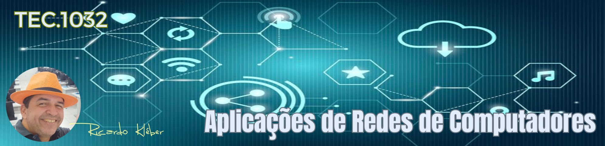

???+ note "Informações Gerais sobre a Disciplina/Turma:"

    * **Disciplina:** TEC.1032 - Aplicações de Redes de Computadores
    * **Turma em Andamento:** 20252.4.03806.361.1M
    * **Período de aulas desta turma/disciplina:** 12/09/2025 a 13/02/2026
    * **Carga-Horária:** 30h (40 aulas)
    * **Professor:** Ricardo Kléber
    * **Aulas Semanais:** Sextas (08:50 as 10:20)
    * **Local:** Laboratório de Redes (D-18) | IFRN/CN
    * **E-Mail do Professor:** ricardokleber@ricardokleber.com.br

??? note "Programa da Disciplina"
    * **Curso:** Curso Superior de Tecnologia em Sistemas para Internet
    * **Disciplina:** Aplicações de Redes de Computadores
    * **Carga-Horária:** 30h (40h/a)
    * **Pré-Requisito(s):** Redes de Computadores
    * **Número de créditos:** 2

    **Ementa**

    Camadas da arquitetura TCP/IP: camada de Transporte e camada Aplicação.

    **Objetivos**

    * Descrever camadas do Modelo TCP/IP: aplicação e transporte;
    * Conhecer os protocolos das camadas de transporte do modelo TCP/IP;
    * Conhecer os protocolos das camadas de aplicação do modelo TCP/IP.

    **Bases Científico-Tecnológicas (Conteúdos)**

    1. Camadas do Modelo/Arquitetura TCP/IP
    2. Camada de transporte: serviços oferecidos; protocolos TCP e UDP
        1. Multiplexação de dados;
        2. Transporte não orientado à conexão;
        3. Transporte orientado à conexão;
        4. Controle de congestionamento.
    3. Camada de aplicação: aspectos gerais e estudos dos modelos de interação de aplicações TCP/IP
        1. HTTP;
        2. DNS;
        3. FTP;
        4. SMTP, POP3 e IMAP.

    **Procedimentos Metodológicos**

    Aulas teóricas expositivas; aulas práticas em laboratório; desenvolvimento de projetos; leitura de textos, palestras, seminários, visitas técnicas, pesquisas bibliográficas.

    **Recursos Didáticos**

    Quadro branco e pincel; computador; Internet; projetor de multimídia.

    **Avaliação**

    Avaliações escritas e práticas; trabalhos individuais e em grupo (listas de exercícios, estudos dirigidos, pesquisas); apresentação dos projetos desenvolvidos.

    **Bibliografia Básica**

    1. TANENBAUM, Andrew S. et al. Redes de computadores. 5. ed. São Paulo: Pearson Prentice Hall, 2011. 582 p. il.
    2. KUROSE, J. F. & Ross, K. W. Redes de Computadores e a Internet: Uma Abordagem Top Down. 6. ed. São Paulo: Pearson Education. 2013.
    3. COMER, D. E.; LIMA, J. V.; ROESLER, V. Redes de Computadores e Internet. Porto Alegre: Bookman, 2016.

    **Bibliografia Complementar**

    1. BENEDETTI, Ryan; ANDERSON, Al. Use a Cabeça! Redes de computadores. Rio de Janeiro: Alta Books, 2010. 497 p. il.
    2. TORRES, G. Redes de Computadores. Rio de Janeiro: Axcel Books, 2001.
    3. J. Postel, J. Postel. 'User Datagram Protocol', Internet RFC768. USC/Information Sciences Institute, August 1980. Disponível em https://www.ietf.org/rfc/rfc768.txt.
    4. J. Postel, J. Postel. 'Transmission Control Protocol', Internet RFC793. USC/Information Sciences Institute, September 1981. Disponível em https://www.ietf.org/rfc/rfc793.txt
    5. Fielding, R. et al. Hypertext Transfer Protocol -- HTTP/1.1. Network Working Group, June 1999.
    Disponível em: https://tools.ietf.org/html/rfc2616

    **Software(s) de Apoio:**

    * Analisadores de protocolos de rede;
    * Simuladores de rede.

??? abstract "Apresentação da Disciplina"
    

        <iframe src="https://docs.google.com/presentation/d/e/2PACX-1vRNT9SO6G43Vkyr_4IVfuZsSeYMgBImRdPCwC2GAAbd3Pjg1GnuRlEi03toar9t0oLKWyo_6PD1ub1S/pubembed?start=false&loop=false&delayms=3000" frameborder="0" width="1058" height="440" allowfullscreen="true" mozallowfullscreen="true" webkitallowfullscreen="true"></iframe>
    

## 1. Bimestre

### 1. Camadas do Modelo/Arquitetura TCP/IP

??? abstract "Slides"
    

        <iframe src="https://docs.google.com/presentation/d/e/2PACX-1vRlg_gTqm-be2yMna-EQVbnyKbF_NSOxodEUpFDO8iuZ07GzgE2N5ha3gC50SpJM71PTWYiTCCJeKY1/pubembed?start=false&loop=false&delayms=3000" frameborder="0" width="1058" height="440" allowfullscreen="true" mozallowfullscreen="true" webkitallowfullscreen="true"></iframe>
    

### 2. Camada de transporte: serviços oferecidos; protocolos TCP e UDP

#### 2.1. Multiplexação de dados
#### 2.2. Transporte não orientado à conexão
#### 2.3. Transporte orientado à conexão
#### 2.4. Controle de congestionamento.

## 2. Bimestre

### 3. Camada de aplicação: aspectos gerais e estudos dos modelos de interação de aplicações TCP/IP

####  3.1. HTTP
#### 3.2. DNS
#### 3.3. FTP
#### 3.4. SMTP, POP3 e IMAP
