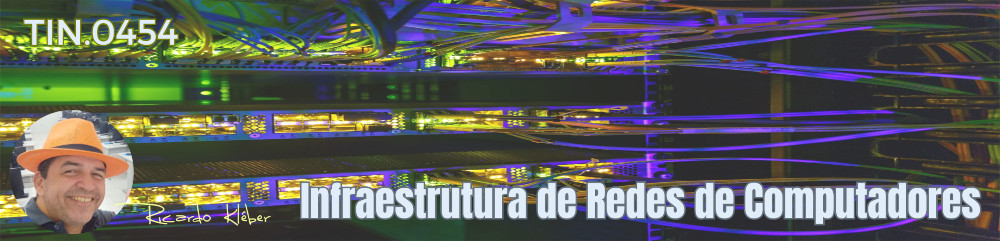

???+ note "Informações Gerais sobre a Disciplina/Turma:"

    * **Disciplina:** TIN.0454 - Infraestrutura de Redes de Computadores
    * **Turma em Andamento:** 20251.3.03112.191.1M
    * **Período de aulas desta turma/disciplina:** 07/04 a 15/08/2025
    * **Carga-Horária:** 90h (120 aulas)
    * **Professor:** Ricardo Kléber
    * **Aulas Semanais:** Sextas (07:00 as 09:35)
    * **Local:** Laboratório de Redes (D-18) | IFRN/CN
    * **E-Mail do Professor:** ricardokleber@ricardokleber.com.br

??? note "Programa da Disciplina"
    * **Curso:** Curso Técnico Integrado em Manutenção e Suporte em Informática
    * **Disciplina:** Infraestrutura de Redes de Computadores
    * **Carga-Horária:** 90h (120h/a)

    **Ementa**

    * Introdução à comunicação de dados;
    * Modelo OSI/ISO;
    * Arquitetura IEEE 802;
    * Arquitetura TCP/IP;
    * Meios físicos e tecnologias de transmissão;
    * Implementação de redes locais;
    * Introdução à segurança de redes de computadores.

    **Objetivos**

    * Entender os conceitos básicos sobre comunicação de dados;
    * Conhecer os recursos utilizados no projeto físico de uma rede;
    * Conhecer normas de padronização de cabeamento estruturado;
    * Conhecer as tecnologias de redes sem fios;
    * Conhecer princípios de Administração e Gerência de Redes de computadores;
    * Implementar na prática uma pequena Rede de Computadores

    **Bases Científico-Tecnológicas (Conteúdos)**

    1. Conceitos básicos em redes de computadores
        1. Conceituação
        2. Topologias
        3. Componentes principais de uma rede
    2. Introdução à comunicação de dados
    3. Arquiteturas de redes de computadores
        1. Modelo OSI/ISO
        2. Arquitetura IEEE 802
        3. Arquitetura TCP/IP
    4. Meios físicos e tecnologias de transmissão
        1. Tipos de conectores
        2. Interfaces de redes
        3. Meios físicos cabeados
        4. Padronização do cabeamento estruturado
        5. Elementos do projeto de cabeamento estruturado
        6. Tecnologias de redes sem fio
        7. Tecnologias alternativas de meios físicos
    5. Ferramentas para confecção e certificação de cabos de par trançado
        1. Alicate de crimpagem
        2. Testador de cabos
    6. Implementação de redes locais
        1. Construção de uma rede ponto a ponto
        2. Construção de uma rede com Hub/Switch
        3. Uso de ferramentas básicas para coleta de estatísticas de rede
    7. Introdução à segurança de redes de computadores   

    **Procedimentos Metodológicos**

    * Aulas teóricas expositivas
    * Aulas práticas em laboratório
    * Visitas técnicas.

    **Recursos Didáticos**

    Utilização de quadro branco, computador, redes, switches, projetor multimídia.

    **Avaliação**

    * Avaliações escritas, orais e práticas
    * Acompanhamento do desenvolvimento das tarefas práticas no laboratório
    * Trabalhos individuais e em grupo extra-aula (listas de exercícios, estudos dirigidos, pesquisas, etc)

    **Bibliografia Básica**

    - SOUSA, Lindeberg Barros de. Redes de computadores - dados, voz e imagem. Érica.
    - ROSS, Keith; KUROSE, James. Redes de Computadores e a Internet: uma nova abordagem top-down. Addison Wesley.
    - LACERDA, Ivan Max Freire de. Cabeamento estruturado - Projeto, Implantação e Certificação. Natal, 2002.

    **Bibliografia Complementar**

    - Catálogo de produtos da Furukawa. Disponível em www.furukawa.com.br
    - Catálogo de produtos da Pial. Disponível em www.pial.com.br
    - VASCONCELOS, Laércio. Como montar e configurar sua rede de PCs - Rápido e fácil, MAKRON Books.
    - DANTAS, Mario. Tecnologias de redes de comunicação e computadores, AXCEL Books.
    - DERFLER, Frank. Tudo sobre cabeamento de redes. Editora Campus. 1993.
    - PINHEIRO, José Maurício. Guia Completo de Cabeamento de Redes. Editora Campus, 2003.
    - TORRES, Gabriel. Redes de Computadores, Ed. Axcel Books.
    - ANDERSON, Al e BENEDETTI, Ryan. Use a cabeça! Redes de Computadores. Alta Books, 2010
    - MENDES, Douglas Rocha. Redes de computadores: teoria e prática. Novatec. 2007.

    **Softwares de Apoio**

    - Sistema Operacional;
    - Software analisador de protocolos de redes;
    - Software simulador de redes; Software específico para desenho de diagramas de redes.

??? abstract "Apresentação da Disciplina"
    

        <iframe src="https://docs.google.com/presentation/d/e/2PACX-1vSE1YSlQzcBbDgqomA3MukPpxrHx65dWIWYbhJdOty072ByBbT_CnFC8ZM3P53SHX2OuH_-MBIG7t-9/embed?start=false&loop=false&delayms=3000" frameborder="0" width="1058" height="440" allowfullscreen="true" mozallowfullscreen="true" webkitallowfullscreen="true"></iframe>
    

## 1. Bimestre
### 1. Conceitos básicos em redes de computadores
#### - 1.1. Conceituação
??? abstract "Slides"
    

        <iframe src="https://docs.google.com/presentation/d/e/2PACX-1vSgdewRZ4IzrngoJn3CQM5oca9645dKhrOOiQ08u-HC1DgFM8_8IlSrLDT86whW00_cA7q1_kJGz4yd/pubembed?start=false&loop=true&delayms=3000" frameborder="0" width="1058" height="440" allowfullscreen="true" mozallowfullscreen="true" webkitallowfullscreen="true"></iframe>
    

#### - 1.2. Topologias
??? abstract "Slides"
    

        <iframe src="https://docs.google.com/presentation/d/e/2PACX-1vROyC_2Qu8vvbLaTagBJ-f7w4UuMmx2YRXqn9FErTGdV3oLR22n_Dhved6EWjJSe5nKHyc6pzeKZ27E/pubembed?start=false&loop=false&delayms=3000" frameborder="0" width="1058" height="440" allowfullscreen="true" mozallowfullscreen="true" webkitallowfullscreen="true"></iframe>
    

#### - 1.3. Componentes principais de uma rede
??? abstract "Slides"
    

        <iframe src="https://docs.google.com/presentation/d/e/2PACX-1vSy2SQV4vg_c2dgbrjT3QbRXcyiT6O06q3dFUXHxourSWL3ApNPcQjDskprlpKHjiHgtc2DLSTqrRIy/pubembed?start=false&loop=false&delayms=3000" frameborder="0" width="1058" height="440" allowfullscreen="true" mozallowfullscreen="true" webkitallowfullscreen="true"></iframe>
    

### 2. Introdução à comunicação de dados
??? abstract "Slides"
    

        <iframe src="https://docs.google.com/presentation/d/e/2PACX-1vRb2yIF5HXoau9rX45tFa-e2mrR8bw2ACEugcqN4VilHA8uHlTIGLSZNRtIueUVTL0jTKWsiFTabccj/pubembed?start=false&loop=false&delayms=3000" frameborder="0" width="1058" height="440" allowfullscreen="true" mozallowfullscreen="true" webkitallowfullscreen="true"></iframe>
    

??? example "Vídeo Ilustrativo: Troca de Protocolo de Comunicação"
    

        <iframe width="560" height="315" src="https://www.youtube.com/embed/z7bYHE14gTs?si=OAReA3oopjb-pYc2" title="YouTube video player" frameborder="0" allow="accelerometer; autoplay; clipboard-write; encrypted-media; gyroscope; picture-in-picture; web-share" referrerpolicy="strict-origin-when-cross-origin" allowfullscreen></iframe>
    

??? danger "Material para Estudo: Capítulos de Livros"
    

        <ul>
            <li><a href="https://mvs.projetos.cn.ifrn.edu.br/livros/Tanenbaum_Cap01.pdf" target="_blank">Tanenbaum - Cap. 01</a></li>
        </ul>
        <ul>
            <li><a href="https://mvs.projetos.cn.ifrn.edu.br/livros/Tanenbaum_Cap02.pdf" target="_blank">Tanenbaum - Cap. 02</a></li>
        </ul>
        <ul>
            <li><a href="https://mvs.projetos.cn.ifrn.edu.br/livros/Forouzan_Cap01.pdf" target="_blank">Forouzan - Cap. 01</a></li>
        </ul>
        <ul>
            <li><a href="https://mvs.projetos.cn.ifrn.edu.br/livros/Forouzan_Cap07.pdf" target="_blank">Forouzan - Cap. 07</a></li>
        </ul>
        <ul>
            <li><a href="https://mvs.projetos.cn.ifrn.edu.br/livros/Kurose_Cap01.pdf" target="_blank">Kurose - Cap. 01</a></li>
        </ul>
    

---
## 2. Bimestre
### 3. Arquiteturas de redes de computadores
#### - 3.1. Modelo OSI/ISO
??? abstract "Slides"
    

        <iframe src="https://docs.google.com/presentation/d/e/2PACX-1vQ58Y0V0XEz9rhZ1b4FjatK0UGEU16BOBHwTSTdsdHQrIvR3IBfA9JiKYep65m3goY2k8xqc8UgDEX3/pubembed?start=false&loop=false&delayms=3000" frameborder="0" width="1058" height="440" allowfullscreen="true" mozallowfullscreen="true" webkitallowfullscreen="true"></iframe>
    

#### - 3.2. Arquitetura TCP/IP
??? abstract "Slides"
    

        <iframe src="https://docs.google.com/presentation/d/e/2PACX-1vRhrw-B5h19Dc0fJRPHhO-gcR86y663Ukwvd8bqt19hLh70DbrFmNtjmaCLu9YIQXW99Z0EZ6VayX-h/pubembed?start=false&loop=false&delayms=3000" frameborder="0" width="1058" height="440" allowfullscreen="true" mozallowfullscreen="true" webkitallowfullscreen="true"></iframe>
    

#### - 3.3. Arquitetura IEEE 802
??? abstract "Slides"
    

        <iframe src="https://docs.google.com/presentation/d/e/2PACX-1vSzjbMPzEEE0X6MktKu-jZm6hnJOEH8bQxZVnHQmclAyihmgvRlrAgF5FuDmvnEj6N4Qff7OYQ07WTl/pubembed?start=false&loop=false&delayms=3000" frameborder="0" width="1058" height="440" allowfullscreen="true" mozallowfullscreen="true" webkitallowfullscreen="true"></iframe>
    

---
## 3. Bimestre
### 4. Meios físicos e tecnologias de transmissão
#### - 4.1. Tipos de conectores
#### - 4.2. Interfaces de redes
#### - 4.3. Meios físicos cabeados
#### - 4.4. Padronização do cabeamento estruturado
#### - 4.5. Elementos do projeto de cabeamento estruturado
#### - 4.6. Tecnologias de redes sem fio
#### - 4.7. Tecnologias alternativas de meios físicos
### 5. Ferramentas para confecção e certificação de cabos de par trançado
#### - 5.1. Alicate de crimpagem
#### - 5.2. Testador de cabos
---
## 4. Bimestre
### 6. Implementação de redes locais
#### - 6.1. Construção de uma rede ponto a ponto
#### - 6.2. Construção de uma rede com Hub/Switch
#### - 6.3. Uso de ferramentas básicas para coleta de estatísticas de rede
### 7. Introdução à segurança de redes de computadores