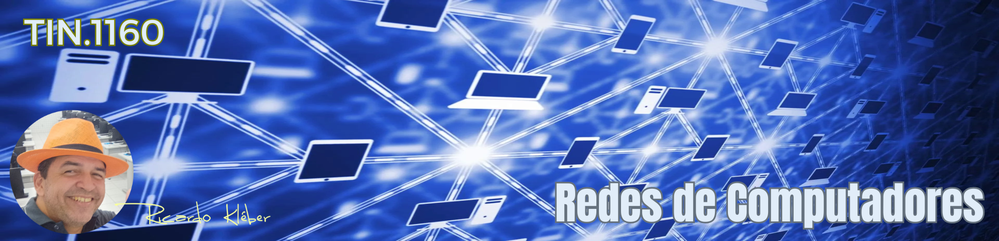

???+ note "Informações Gerais sobre a Disciplina/Turma:"

    * **Disciplina:** TIN.1160 - Redes de Computadores
    * **Turma em Andamento:** 20251.2.03401.478.1M
    * **Período de aulas desta turma/disciplina:** 07/04 a 15/08/2025
    * **Carga-Horária:** 90h (120 aulas)
    * **Professor:** Ricardo Kléber
    * **Aulas Semanais:** Quartas e Quintas (08:50 as 10:20)
    * **Local:** Laboratório de Redes (D-18) | IFRN/CN
    * **E-Mail do Professor:** ricardokleber@ricardokleber.com.br

??? note "Programa da Disciplina"
    * **Curso:** Curso Técnico Integrado em Informática
    * **Disciplina:** Redes de Computadores
    * **Carga-Horária:** 90h (120h/a)

    **Ementa**

    * Introdução às redes de computadores;
    * Estudo dos padrões e modelos de redes;
    * Noções de redes locais cabeadas e sem fio;
    * Noções de dispositivos de redes e Pilha de protocolos TCP/IP;
    * Discussão sobre segurança de redes.

    **Objetivos**

    * Compreender os conceitos básicos sobre comunicação de dados.
    * Compreender e diferenciar os modelos de referência usados em redes de computadores.
    * Compreender a aplicação das diversas camadas do modelo TCP/IP.
    * Compreender o funcionamento de redes locais cabeadas e sem fio.
    * Compreender as principais ameaças e vulnerabilidades de segurança de redes.

    **Bases Científico-Tecnológicas (Conteúdos)**

    1. Introdução a redes.
        1. História e evolução das redes de computadores.
        2. Representação e topologias de redes.
        3. Componentes de redes de computadores.
        4. Classificação das redes quanto à área de cobertura.
    2. Padrões e modelos de redes.
        1. Visão geral do modelo OSI.
        2. Visão geral da arquitetura TCP/IP.
    3. Camada de acesso à rede.
        1. Visão geral da família Ethernet (IEEE 802.3).
        2. Introdução às redes sem fio (IEEE 802.11).
    4. Camada de internet TCP/IP.
        1. Protocolo IP (IPv4 e IPv6).
        2. Endereçamento IP (IPv4 e IPv6).
        3. Roteamento IP (estático e dinâmico).
        4. Protocolos ARP, ICMP.
    5. Camada de transporte TCP/IP.
        1. Protocolo TCP.
        2. Protocolo UDP.
    6. Camada de aplicação TCP/IP.
        1. Protocolos de e-mail e Web (SMTP, POP, IMAP, HTTP).
        2. Protocolos de infraestrutura de rede (DNS e DHCP).
        3. Serviços de compartilhamento de arquivo (FTP).
        4. Protocolos de terminal remoto (TELNET, SSH).     
    7. Segurança de redes.
        1. Introdução a segurança da informação.
        2. Ameaças, ataques e vulnerabilidades.
        3. Soluções de segurança (anti-malware, firewall, IPS/IDS, VPN).

    **Procedimentos Metodológicos**

    * Aulas teóricas expositivas.
    * Aulas práticas em laboratório com uso de roteiros de aula.
    * Disponibilização de slides, vídeos, roteiros e/ou apostilas no sistema acadêmico e/ou outro ambiente virtual de aprendizagem.
    * Uso de metodologias ativas inovadoras (como, por exemplo, computação desplugada, aprendizagem baseada em equipes, aprendizagem baseada em problemas), com ações que conduzam o aluno a otimizar sua aprendizagem por meio de diferentes habilidades, inserindo naturalmente, nesse processo, o aluno com deficiência.
    * Atividades voltadas à formação do estudante com ênfase tanto nos conhecimentos específicos como em procedimentos de colaboração, interdisciplinaridade, desenvolvimento de raciocínio lógico e trabalho em grupo, buscando a experimentação da dialética ação-reflexão-ação.

    **Recursos Didáticos**

    * Utilização de quadro branco;
    * Computador com acesso à internet;
    * Projetor multimídia;
    * Equipamentos e ferramentas para práticas em laboratório.

    **Avaliação**

    A avaliação será contínua e cumulativa, com prevalência dos aspectos qualitativos sobre os quantitativos, buscando a reconstrução do conhecimento, a participação e a autonomia individual do discente em íntima cooperação com o coletivo. Para tanto, poderão ser utilizados instrumentos avaliativos diversos (projetos, pesquisas atividades, listas de exercícios, provas, etc.) a fim de quantificar o desempenho do discente nas aulas práticas e em outras modalidades de metodologias ativas que poderão ser utilizadas. Neste sentido, a avaliação dos aspectos qualitativos compreende, além da acumulação de conhecimentos (o que remete para a avaliação quantitativa), o domínio do processo de aprendizagem, no que se refere a avanços e recuos, e as possibilidades de autoavaliação e de reorientação no processo.

    **Bibliografia Básica**

    - TANEMBAUM, Andrew. Redes de Computadores. São Paulo: Bookman, 2021.
    - ROSS, Keith e KUROSE, JAMES. Redes de Computadores e a Internet: uma abordagem top-dow. São Paulo: Bookman, 2021.
    - FOROUZAN, Behrouz A. Comunicação de dados e redes de computadores. São Paulo: AMGH, 2010.
    - FILIPPETTI, Marco Aurélio. CCNA 6.0: guia completo de estudo. 2. ed. Florianópolis: Visual Books, 2019.

    **Bibliografia Complementar**

    - TORRES, Gabriel. Redes de computadores. Rio de Janeiro (RJ): Novaterra, 2014.
    - SOARES, Luiz Fernando Gomes; LEMOS, Guido; COLCHER, Sérgio. Redes de computadores: das LANs, MANs e WANs às redes ATM. Rio de Janeiro: Editora Campus, 1997.
    - STALLINGS, William. Criptografia e segurança de redes: princípios e práticas. São Paulo: Pearson Prentice Hall, 2015.
    - BRITO, Samuel Henrique Bucke. IPv6: o novo protocolo da Internet. São Paulo: Novatec, 2013. CERT.BR. Cartilha de segurança para Internet. 2. ed. São Paulo: CGI Br. 2012

??? abstract "Apresentação da Disciplina"
    

        <iframe src="https://docs.google.com/presentation/d/e/2PACX-1vSiwmbBQT5zrsRLl4HSCar8iEldf_ryepntW2VBYdhlBmY8O4JyWdVPZmAwE3-W25YXBKsbH444X1F5/embed?start=false&loop=false&delayms=3000" frameborder="0" width="1058" height="440" allowfullscreen="true" mozallowfullscreen="true" webkitallowfullscreen="true"></iframe>
    

## 1. Bimestre
### 1. Introdução a redes.
#### - 1.1. História e evolução das redes de computadores.
#### - 1.2. Representação e topologias de redes.
#### - 1.3. Componentes de redes de computadores.
#### - 1.4. Classificação das redes quanto à área de cobertura.
### 2. Padrões e modelos de redes.
#### - 2.1. Visão geral do modelo OSI.
#### - 2.2. Visão geral da arquitetura TCP/IP.
### 3. Camada de acesso à rede.
#### - 3.1. Visão geral da família Ethernet (IEEE 802.3).
#### - 3.2. Introdução às redes sem fio (IEEE 802.11).
## 2. Bimestre
### 4. Camada de internet TCP/IP.
#### - 4.1. Protocolo e Endereçamento IP (IPv4).
## 3. Bimestre
#### - 4.2. Protocolo e Endereçamento IP (IPv6).
#### - 4.3. Roteamento IP (estático e dinâmico).
#### - 4.4. Protocolos ARP, ICMP.
### 5. Camada de transporte TCP/IP.
#### - 5.1. Protocolo TCP.
#### - 5.2. Protocolo UDP.
## 4. Bimestre
### 6. Camada de aplicação TCP/IP.
#### - 6.1. Protocolos de e-mail e Web (SMTP, POP, IMAP, HTTP).
#### - 6.2. Protocolos de infraestrutura de rede (DNS e DHCP).
#### - 6.3. Serviços de compartilhamento de arquivo (FTP).
#### - 6.4. Protocolos de terminal remoto (TELNET, SSH).     
### 7. Segurança de redes.
#### - 7.1. Introdução a segurança da informação.
#### - 7.2. Ameaças, ataques e vulnerabilidades.
#### - 7.3. Soluções de segurança (anti-malware, firewall, IPS/IDS, VPN).